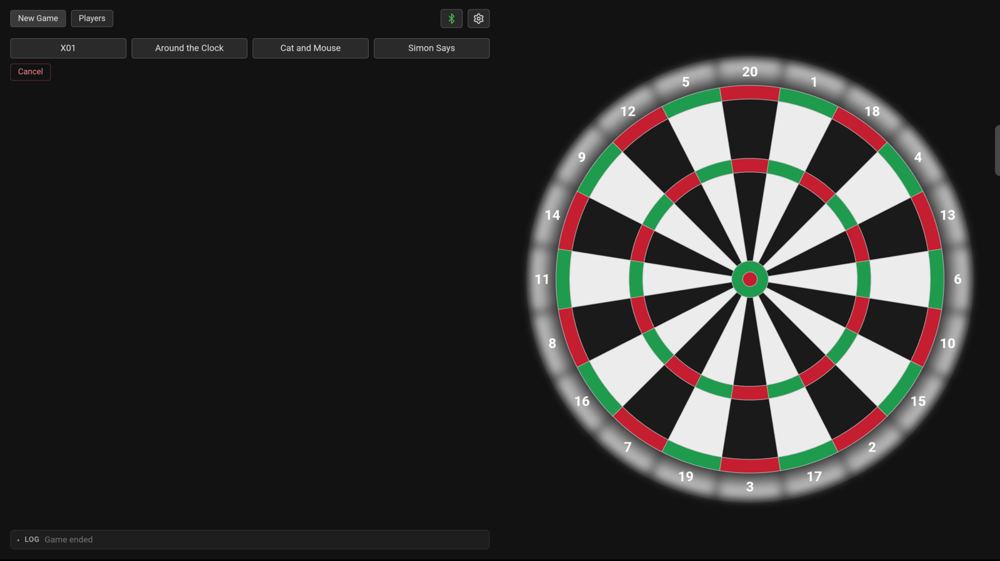
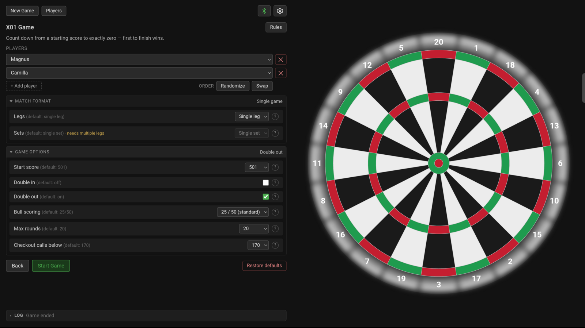
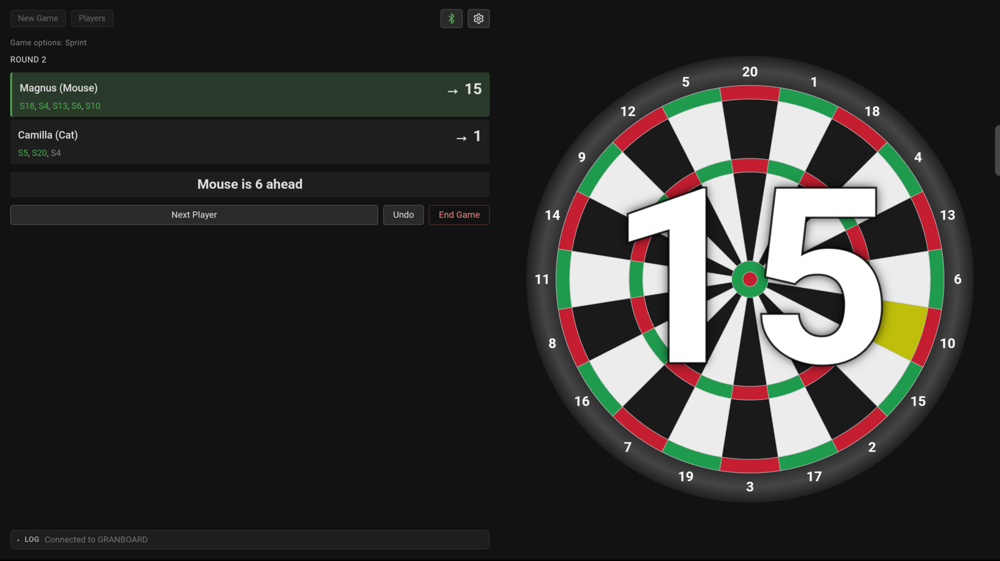
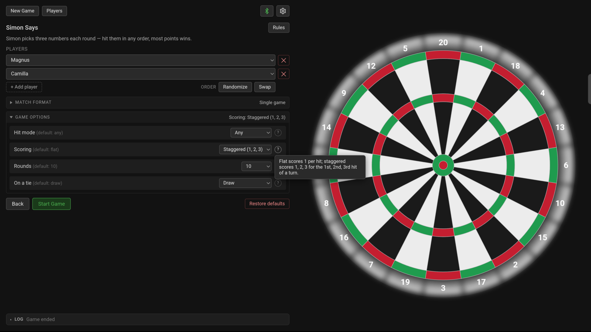
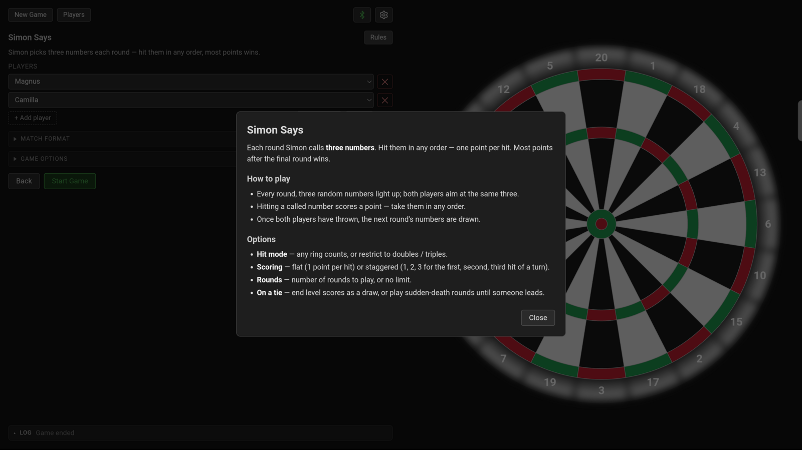
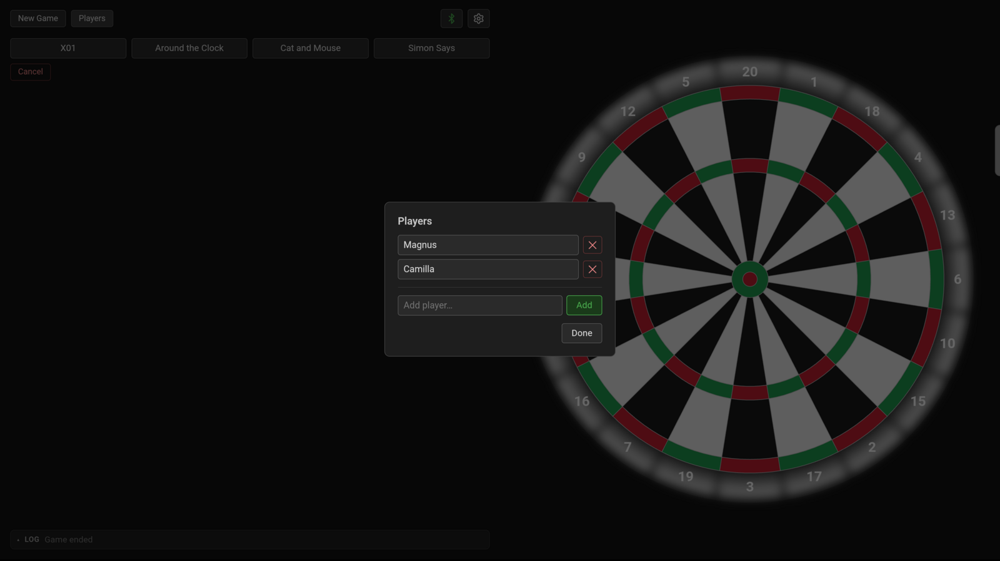
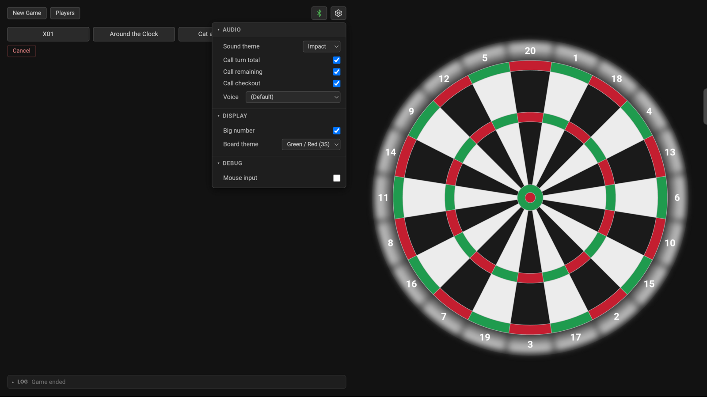
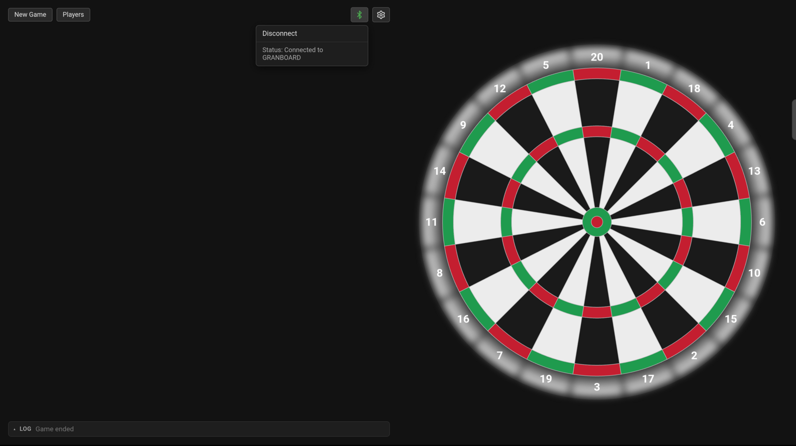

# Ghost Board

Web interface for [Granboard](https://granboards.com/product-category/gran-board-3/) electronic dartboards. Connects via WebBluetooth and displays dart hits on an interactive board.

## How it works

The Granboard itself is a fairly simple device — it detects where a dart lands and has a ring of LEDs around the board, but that's it. There is no game logic, no scoring, and no display on the board itself. All of that is handled by the app it connects to.

Ghost Board is a web-based alternative to the official Granboard app. It connects to the board over Bluetooth Low Energy (BLE), receives hit events, and sends LED commands back. Everything else — game rules, scoring, sound effects, voice callouts, and the visual dartboard — runs entirely in the browser.

## Screenshots

<em>Click any image for full size.</em>

<table border="0" cellspacing="0">
  <tr>
    <td width="50%" valign="top"><a href="screenshots/new-game-picker.png"></a><br><sub>Choose a game — X01, Around the Clock, Cat &amp; Mouse, Simon Says, Count Up, Score Rush, or Cricket.</sub></td>
    <td width="50%" valign="top"><a href="screenshots/x01-setup.png"></a><br><sub>X01 setup — players, match format (legs / sets), and game options.</sub></td>
  </tr>
  <tr>
    <td width="50%" valign="top"><a href="screenshots/gameplay-cat-and-mouse.png"></a><br><sub>Cat &amp; Mouse in play — scoreboard, big on-board number, undo / end game.</sub></td>
    <td width="50%" valign="top"><a href="screenshots/game-options-help.png"></a><br><sub>Collapsible game options with per-option help tooltips.</sub></td>
  </tr>
  <tr>
    <td width="50%" valign="top"><a href="screenshots/game-rules.png"></a><br><sub>Built-in rules and how-to-play for each game.</sub></td>
    <td width="50%" valign="top"><a href="screenshots/player-config.png"></a><br><sub>Manage named players, reused across games.</sub></td>
  </tr>
  <tr>
    <td width="50%" valign="top"><a href="screenshots/settings-menu.png"></a><br><sub>Settings — sound theme, voice callouts, board theme, and more.</sub></td>
    <td width="50%" valign="top"><a href="screenshots/bluetooth-connection.png"></a><br><sub>Bluetooth connection to the Granboard, with live status.</sub></td>
  </tr>
</table>

## Features

- Interactive SVG dartboard with real-time hit highlighting
- Named players, 1–8 per game (Cat and Mouse is always two)
- Legs & sets match play with a rotating starting player and a leg-by-leg history
- **Undo** to correct false hits (vibration/sensor glitches), and one-tap **Rematch**
- Heads-up big number on the board showing the current player's score/target
- Full-screen win / draw / leg / set celebration overlay
- BLE connection with auto-reconnect; status shown in a Bluetooth icon (red / green / yellow) with toast messages
- LED control — hit flash, player-switch sweep, target highlighting, game-aware on/off
- Simulated LED ring on the SVG board — the web board mirrors the physical board's LEDs (targets, X01 checkout, switch sweep, hit flashes), so the full effect is visible without hardware
- Board colour themes matching the LED Granboard range — Green / red (3S), Blue / red (3S), White (3S), and Granboard 132 — selectable in Settings → Display
- Sound effects with three themes (impact, gunshot, arcade)
- Voice callouts — turn total, remaining score, per-dart checkout calls; configurable voice via browser SpeechSynthesis
- Per-game rules and per-option help, with collapsible setup sections that summarise the current config
- Collapsible event-log console
- Installable PWA — add to home screen / desktop, works offline, and auto-updates to the latest deploy
- Game state persistence — survives page refresh and BLE disconnect
- Settings stored in localStorage via a gear menu
- Debug mode — mouse clicks on the board simulate dart hits
- Responsive layout with a mobile breakpoint — works in both landscape and portrait orientation

## Players

Games are played by **named players**, managed in a Player Configuration screen. Most games take **1–8 players** (Cat and Mouse is always two). The roster remembers who played last, enforces unique names, and lets you reorder players before starting — swap (2 players) or randomize / rotate / reverse (3+).

## Match play (legs & sets)

Any game can be played as a match rather than a single game:

- **Best-of-N legs** decides a set, and **best-of-N sets** decides the match (default is a single leg / single set, i.e. a one-off game). Sets require more than one leg.
- The **starting player rotates** each leg, carried across set boundaries. Cat and Mouse swaps the **Mouse/Cat roles** each leg so both players get equal time with the head start.
- During match play, each game's draw-preventing option is **locked** to its no-draw value — a leg must produce a winner.
- The round line shows the current **Set / Leg**, each player's card shows their **legs/sets won and rank**, and a **History** button opens the leg-by-leg breakdown.

## Games

- **X01** (301 / 501 / 701 / 1001)
  - *Also known as: 01*
  - 1–8 players
  - Bust reverts the entire turn and locks the remaining darts
  - Per-player 3-dart average
  - Checkout path suggestions for the current player (standard competition checkouts for double-out, solved otherwise), shown on the card and lit on the board's LED ring
  - Options:
    - Start score — 301 / 501 / 701 / 1001 (default: 501)
    - Double in (default: off)
    - Double out (default: on)
    - Bull scoring — 25/50 or 50/50 (default: 25/50)
    - Max rounds (default: 20, 0 for no limit)
    - Checkout calls below — spoken checkout threshold (default: 170, off to disable)
- **Around the Clock**
  - *Also known as: Around the World, Clock*
  - Hit 1 through 20 in order, optionally finishing on bull
  - 1–8 players
  - LED highlights the target number; voice calls the next target on a hit; a wrong number plays the miss sound
  - Options:
    - Bull finish — off / single bull / double bull (default: single bull)
    - Hit mode — any / doubles only / triples only (default: any)
    - Multi-step — doubles advance 2, triples advance 3 (default: off)
    - Max rounds (default: no limit)
- **Cat and Mouse**
  - Both players move clockwise around the 20 segments. The mouse starts at 20; the cat starts a few segments behind (the head start). The mouse wins by completing a full lap; the cat wins by catching up to or passing the mouse.
  - Exactly 2 players (Mouse vs Cat)
  - Options:
    - Head start — 1 to 5 segments (default: 1)
    - Hit mode — any / doubles only / triples only (default: any)
    - Multi-step — doubles advance 2, triples advance 3 (default: off)
    - Sprint — a perfect turn (all darts hit) earns a bonus set of darts (default: off)
    - Max rounds (default: no limit)
    - Round limit result — mouse wins or draw (default: mouse wins)
- **Simon Says**
  - Each round, Simon picks 3 unique target numbers — hit them in any order
  - All players throw at the same targets; most points after the final round wins
  - 1–8 players
  - LED highlights all remaining targets; voice announces the 3 numbers
  - Options:
    - Hit mode — any / doubles only / triples only (default: any)
    - Scoring — flat (1 point per hit) or staggered (1 / 2 / 3 for the first, second, third hit of a turn) (default: flat)
    - Rounds — 5 / 10 / 15 / 20 / no limit (default: 10)
    - On a tie — draw, or play sudden-death rounds until someone leads (default: draw)
- **Count Up**
  - Add up your score over a fixed number of rounds — every dart counts, no bust or checkout
  - Highest total after the final round wins; the turn total and each player's running total are called out
  - 1–8 players
  - Options:
    - Rounds — 8 or custom (default: 8)
    - Bull scoring — 25/50 or 50/50 (default: 25/50)
    - Singles only — count doubles & trebles at face value (default: off)
    - On a tie — draw, or play sudden-death rounds until someone leads (default: draw)
- **Score Rush**
  - *Also known as: High Score*
  - Race to a target score — first to reach it wins; no exact finish or checkout (unlike X01)
  - Highest-scoring, beginner-friendly counterpart to X01
  - 1–8 players
  - Options:
    - Target — 300 or custom, 100–10000 (default: 300)
    - Bull scoring — 25/50 or 50/50 (default: 25/50)
    - Singles only — count doubles & trebles at face value (default: off)
- **Cricket**
  - Close 15–20 and the bull — hit each three times — then score on your closed numbers
  - Single = 1 mark, double = 2, treble = 3; outer bull = 1 mark, inner bull = 2
  - 1–8 players; per-player marks grid on the scoreboard
  - Options:
    - Scoring — Standard (highest total among those closed out wins), Cut-throat (your points go to opponents who haven't closed the number; lowest total wins), or Simple (no score — first to close all seven wins)
    - Numbers — 15–20 + bull (standard), or Random (six random numbers + bull each game)

## Getting Started

```bash
npm install
npm run dev
```

Or via Docker:

```bash
docker compose -f docker/compose.yml up
```

Then open `http://localhost:3501` and click the Bluetooth icon to pair with your Granboard.

## Install it like an app

Ghost Board is a **PWA** (Progressive Web App) — which is just a website you can install. In a supported browser, look for an **Install** option in the address bar, or **Add to Home Screen** on a phone or tablet. Installing puts a Ghost Board icon on your home screen / desktop, opens it in its own window (no browser tabs or address bar), lets it work offline, and keeps it up to date automatically. You don't have to install it — it runs fine in a normal browser tab too.

## Secure Context

WebBluetooth only works in a [secure context](https://developer.mozilla.org/en-US/docs/Web/Security/Secure_Contexts). `http://localhost` counts as secure, so running the app and opening it on the **same machine** works out of the box.

Accessing the app from another device over the network (e.g. `http://192.168.1.x:3501`) over plain HTTP will **not** work — the browser blocks WebBluetooth. For that you need to serve the app over HTTPS.

## Browser Support

Ghost Board requires **WebBluetooth**, which is supported in:

- **Chrome** (desktop & Android)
- **Edge** (desktop)
- **Opera** (desktop)

Safari and Firefox do not support WebBluetooth.

### Linux

On Linux, WebBluetooth is disabled by default in Chrome. To enable it:

1. Open `chrome://flags/#enable-web-bluetooth`
2. Set the flag to **Enabled**
3. Restart Chrome

## Attribution

BLE protocol and segment mapping derived from:

- [GranBoard-with-Autodarts](https://github.com/Lennart-Jerome/GranBoard-with-Autodarts) by Lennart-Jerome — Granboard BLE protocol reverse-engineering and Autodarts integration
- [Granboard BLE Gist](https://gist.github.com/aceslick911/01a9e8edc97495a5825087de1ceee273) by aceslick911 — LED control hex codes and protocol documentation
