# Ghost Board

Web interface for [Granboard](https://granboards.com/product-category/gran-board-3/) electronic dartboards. Connects via WebBluetooth and displays dart hits on an interactive board.

<p align="center">
  <a href="screenshots/landing.png">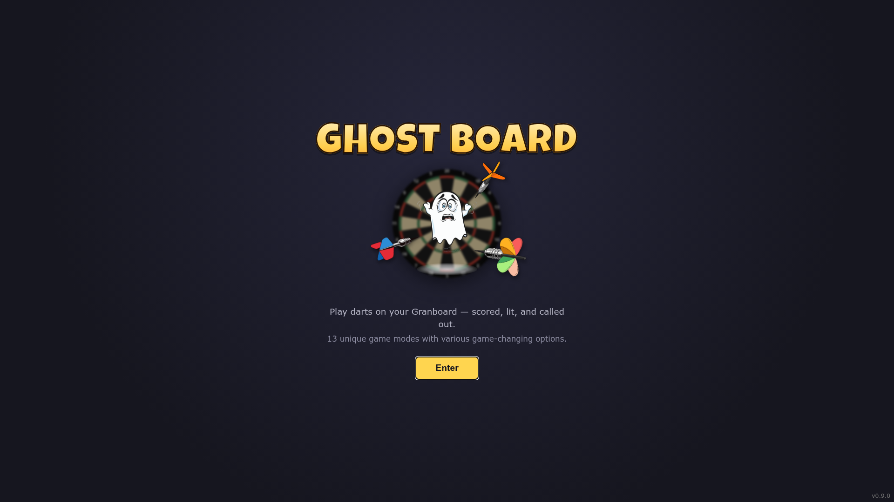</a>
</p>

## Contents

- [How it works](#how-it-works)
- [Screenshots](#screenshots)
- [Features](#features)
- [Players](#players)
- [Teams](#teams)
- [Match play (legs & sets)](#match-play-legs--sets)
- [Games](#games)
- [Getting Started](#getting-started)
- [Install it like an app](#install-it-like-an-app)
- [Secure Context](#secure-context)
- [Browser Support](#browser-support)
- [Changelog](#changelog)
- [Attribution](#attribution)

## How it works

The Granboard itself is a fairly simple device — it detects where a dart lands and has a ring of LEDs around the board, but that's it. There is no game logic, no scoring, and no display on the board itself. All of that is handled by the app it connects to.

Ghost Board is a web-based alternative to the official Granboard app. It connects to the board over Bluetooth Low Energy (BLE), receives hit events, and sends LED commands back. Everything else — game rules, scoring, sound effects, voice callouts, and the visual dartboard — runs entirely in the browser.

## Screenshots

<em>Click any image for full size.</em>

### The app

<table border="0" cellspacing="0">
  <tr>
    <td width="50%" valign="top"><a href="screenshots/new-game-picker.png">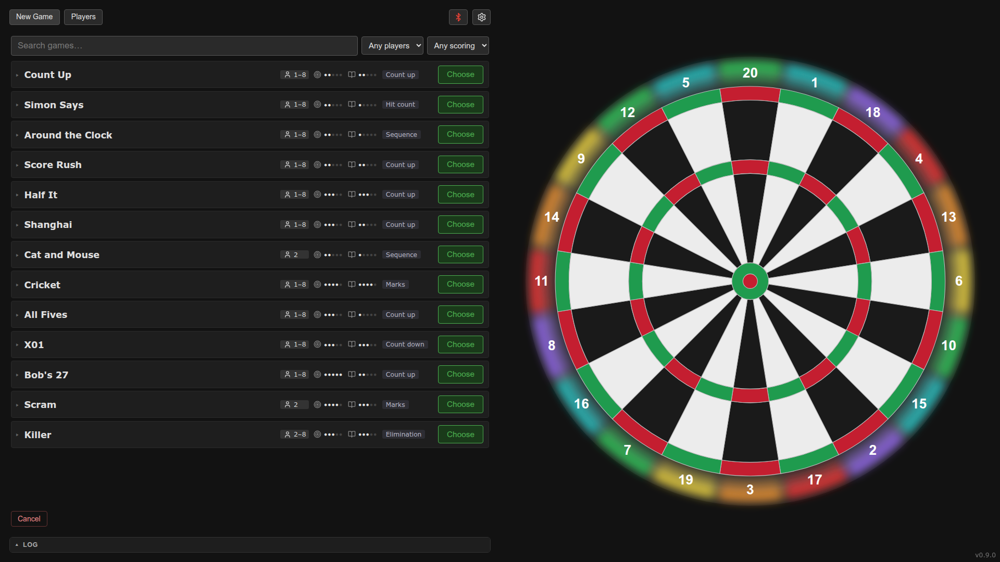</a><br><sub>Pick a game — 14 modes, filter by player count or scoring style.</sub></td>
    <td width="50%" valign="top"><a href="screenshots/x01-setup.png">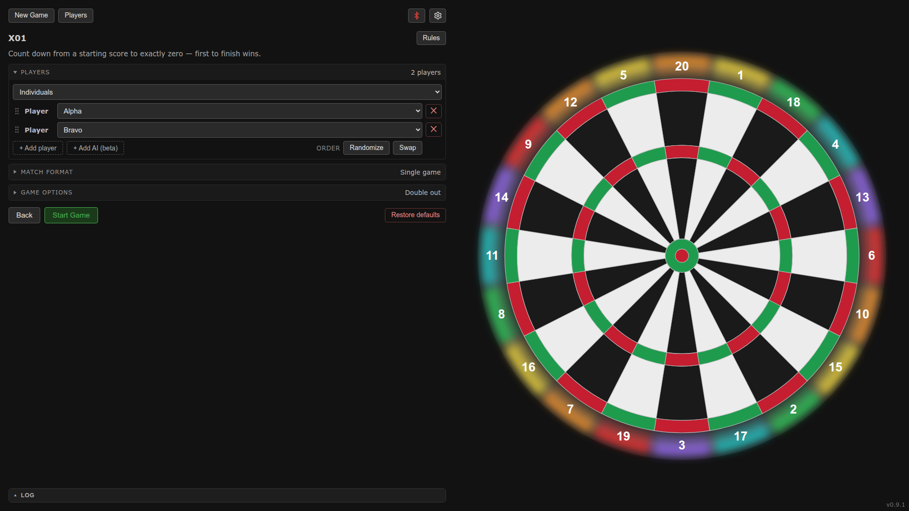</a><br><sub>Setup — players, match format (legs / sets), and game options.</sub></td>
  </tr>
  <tr>
    <td width="50%" valign="top"><a href="screenshots/game-options-help.png">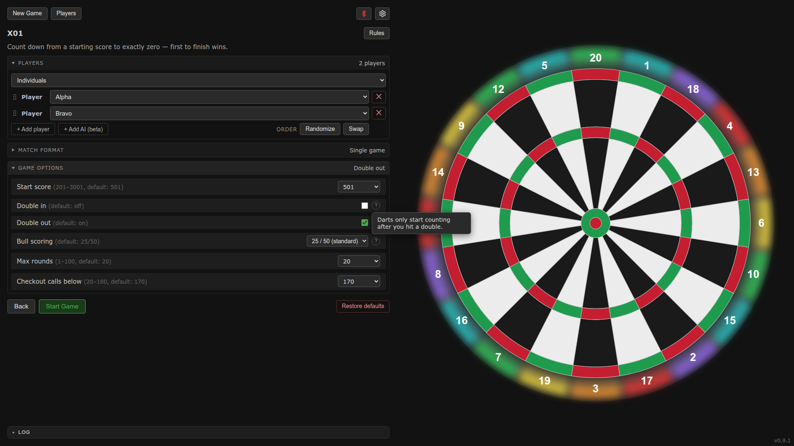</a><br><sub>Collapsible options, each with a "?" that explains what it does.</sub></td>
    <td width="50%" valign="top"><a href="screenshots/game-rules.png">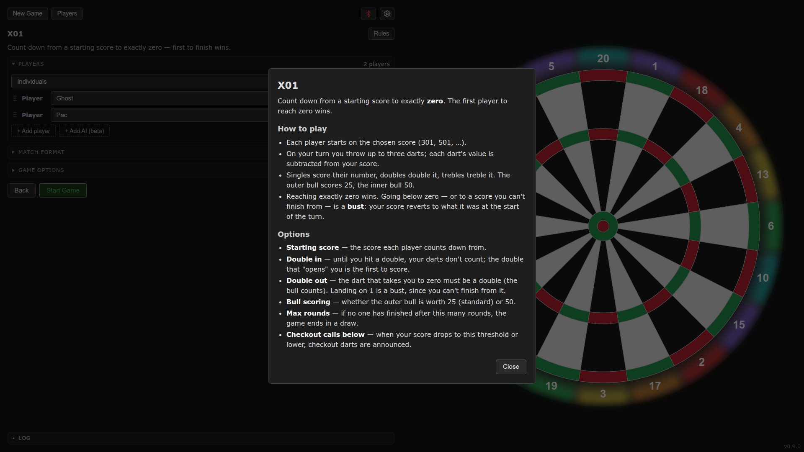</a><br><sub>Built-in rules and how-to-play for every game.</sub></td>
  </tr>
  <tr>
    <td width="50%" valign="top"><a href="screenshots/player-config.png">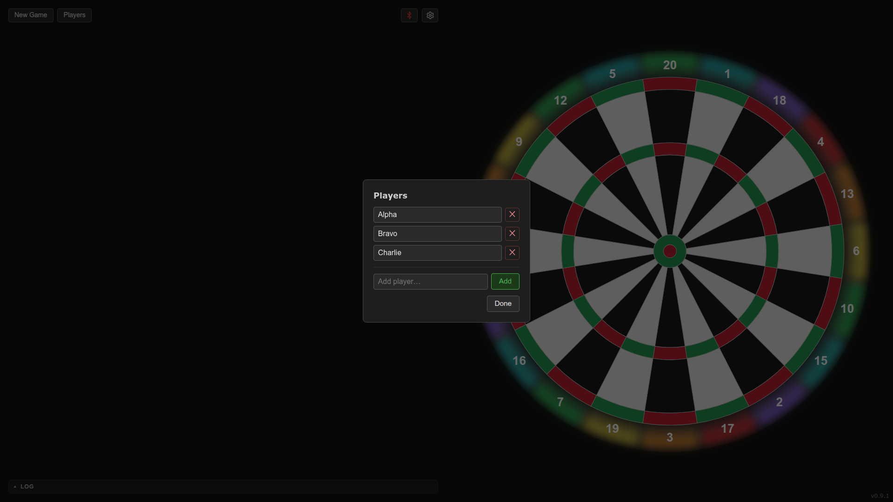</a><br><sub>Named players, reused across games.</sub></td>
    <td width="50%" valign="top"><a href="screenshots/settings-menu.png">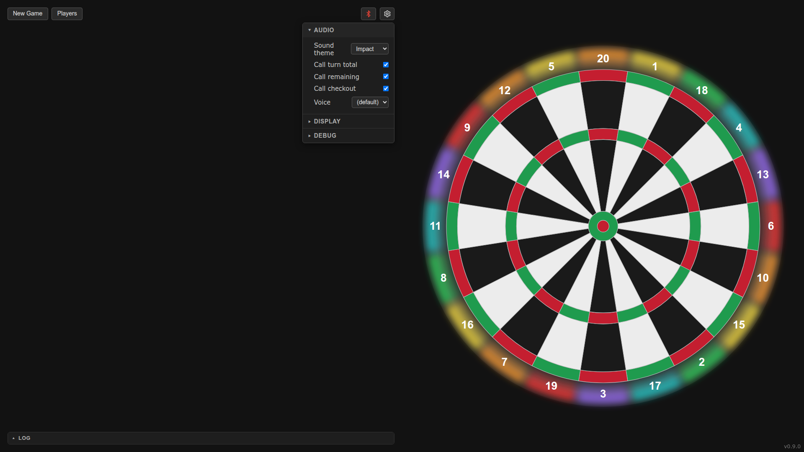</a><br><sub>Settings — sound theme, voice callouts, board theme, and more.</sub></td>
  </tr>
  <tr>
    <td width="50%" valign="top"><a href="screenshots/bluetooth-connection.png">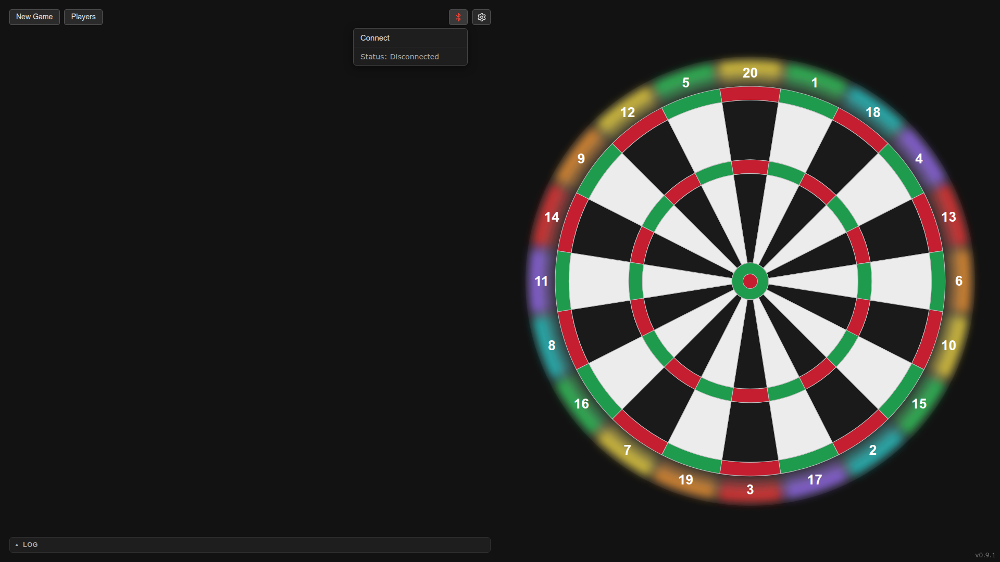</a><br><sub>Bluetooth connection to the Granboard, with live status.</sub></td>
    <td width="50%" valign="top"></td>
  </tr>
</table>

### Game modes

<em>A selection — see <a href="#games">Games</a> for all 13.</em>

<table border="0" cellspacing="0">
  <tr>
    <td width="50%" valign="top"><a href="screenshots/gameplay-x01.png">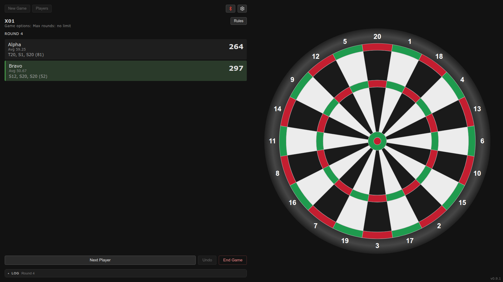</a><br><sub><b>X01</b> — count down to zero, with 3-dart averages and checkout suggestions.</sub></td>
    <td width="50%" valign="top"><a href="screenshots/gameplay-cricket.png">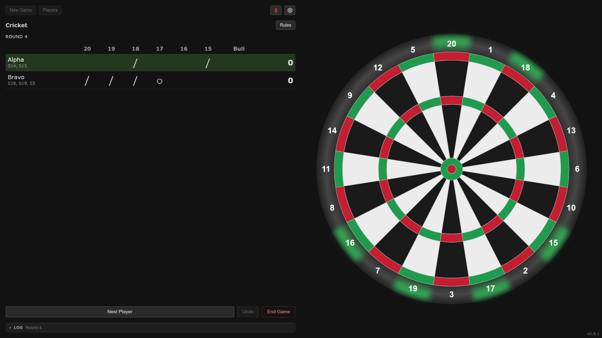</a><br><sub><b>Cricket</b> — close 15–20 and the bull on a marks grid; targets lit on the board.</sub></td>
  </tr>
  <tr>
    <td width="50%" valign="top"><a href="screenshots/gameplay-all-fives.png">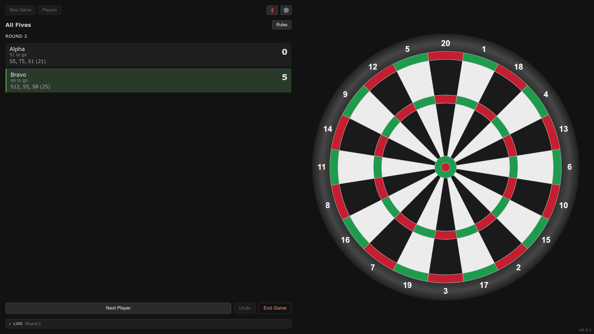</a><br><sub><b>All Fives</b> — three-dart totals in multiples of five; the board lights numbers that keep you on 5.</sub></td>
    <td width="50%" valign="top"><a href="screenshots/gameplay-around-the-clock.png">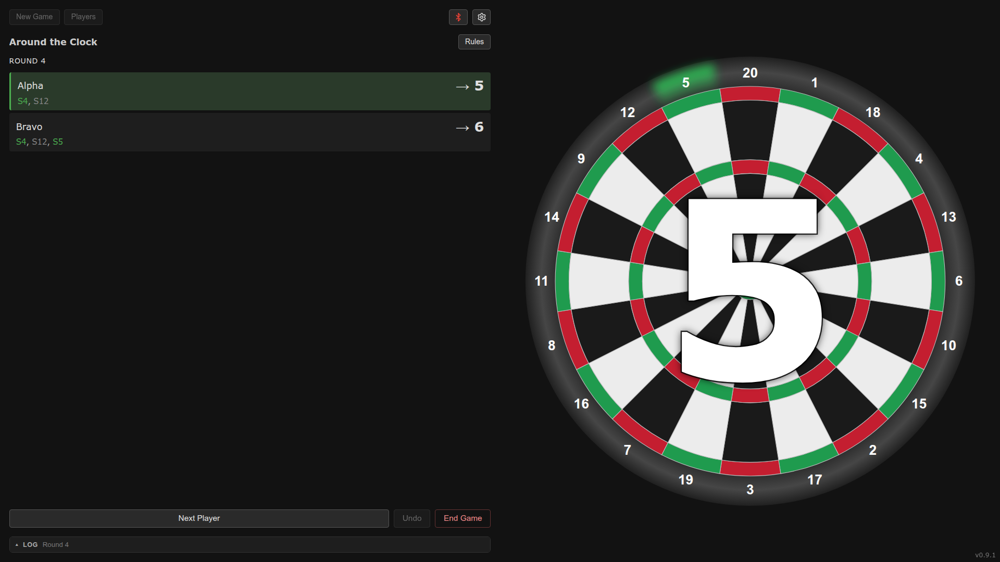</a><br><sub><b>Around the Clock</b> — race 1 → 20 in order, with the target number lit.</sub></td>
  </tr>
  <tr>
    <td width="50%" valign="top"><a href="screenshots/gameplay-cat-and-mouse.png">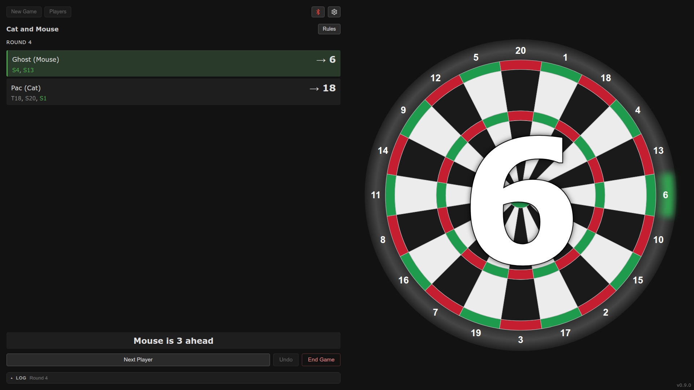</a><br><sub><b>Cat &amp; Mouse</b> — a chase around the board: the mouse laps, the cat catches.</sub></td>
    <td width="50%" valign="top"><a href="screenshots/gameplay-scram.png">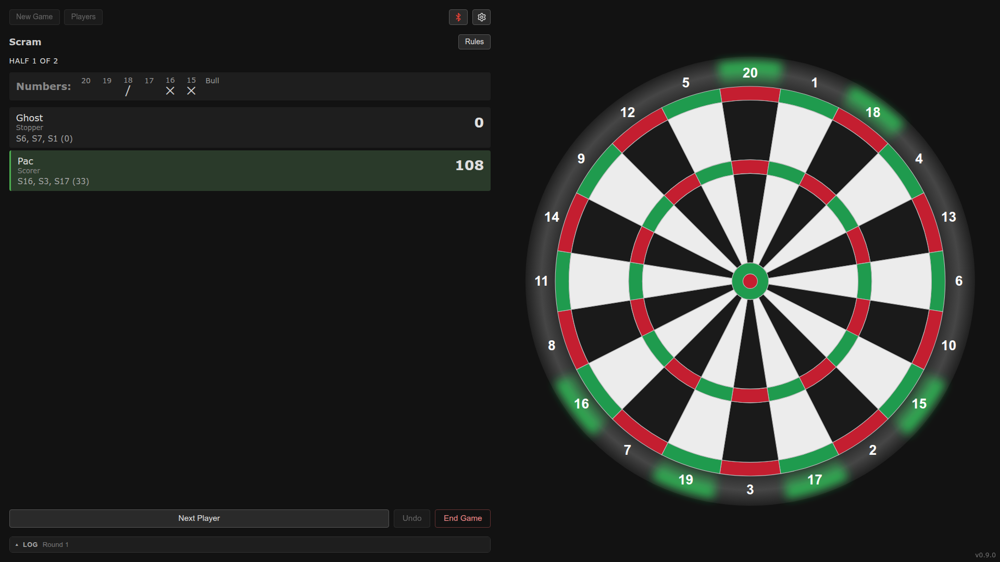</a><br><sub><b>Scram</b> — one player closes the numbers while the other piles on points, then swap.</sub></td>
  </tr>
  <tr>
    <td width="50%" valign="top"><a href="screenshots/gameplay-simon-says.png">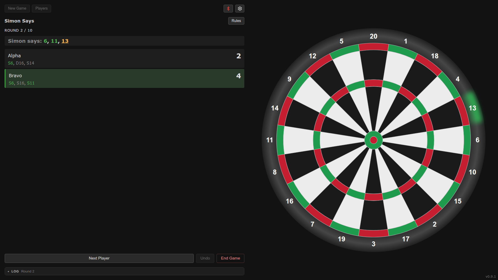</a><br><sub><b>Simon Says</b> — three fresh targets each round; everyone throws at the same numbers.</sub></td>
    <td width="50%" valign="top"><a href="screenshots/gameplay-killer.png">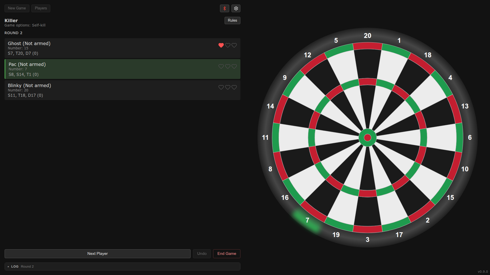</a><br><sub><b>Killer</b> — arm up, then knock the lives off your opponents; last one standing wins.</sub></td>
  </tr>
  <tr>
    <td width="50%" valign="top"><a href="screenshots/gameplay-domination.png">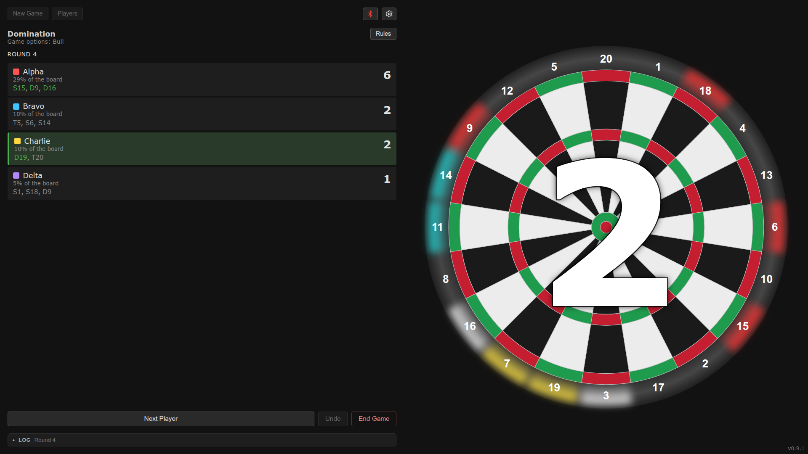</a><br><sub><b>Domination</b> — claim a number and take over the board; each player's territory glows in their own colour.</sub></td>
    <td width="50%" valign="top"></td>
  </tr>
</table>

### Players &amp; teams

<table border="0" cellspacing="0">
  <tr>
    <td width="50%" valign="top"><a href="screenshots/eight-player-setup.png">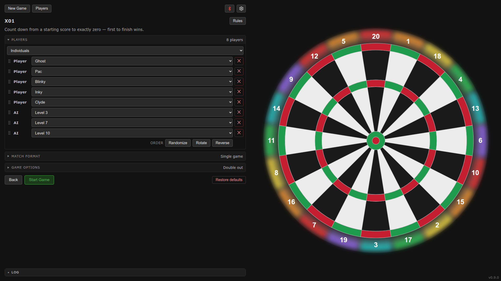</a><br><sub>Up to 8 players — humans and AI at mixed levels.</sub></td>
    <td width="50%" valign="top"><a href="screenshots/team-setup.png">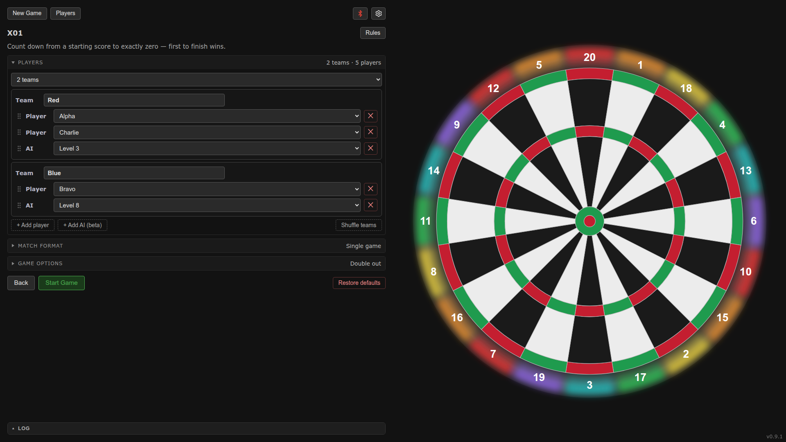</a><br><sub>Play as teams — uneven sides, humans and AI, sharing a score.</sub></td>
  </tr>
</table>

### Match play &amp; celebrations

<table border="0" cellspacing="0">
  <tr>
    <td width="50%" valign="top"><a href="screenshots/match-play.png">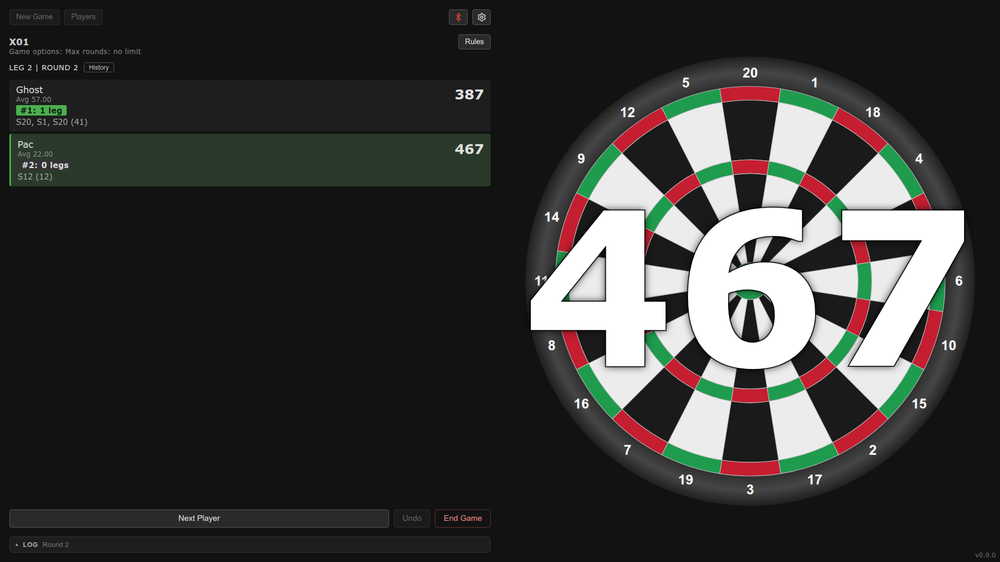</a><br><sub>Legs and sets — each side's legs won, rank, and a leg-by-leg history.</sub></td>
    <td width="50%" valign="top"><a href="screenshots/win-overlay.png">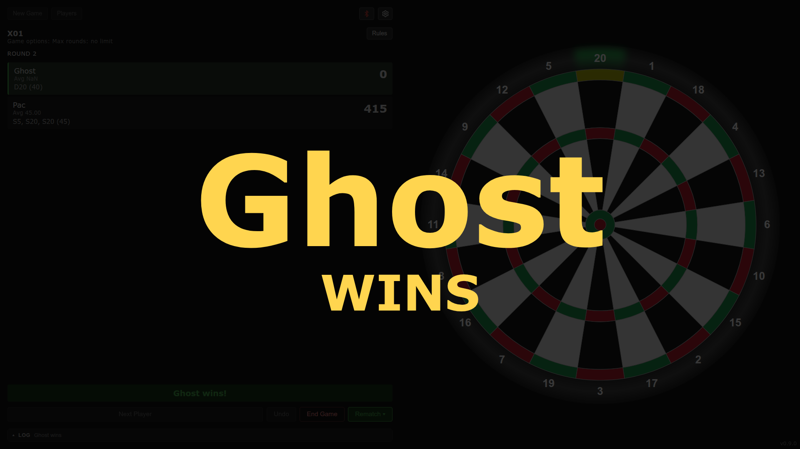</a><br><sub>Full-screen win / draw / leg / set celebration.</sub></td>
  </tr>
</table>

## Features

- Interactive SVG dartboard with real-time hit highlighting
- Named players, 1–8 per game (Cat and Mouse is always two)
- **Teams** — play any game as 2, 3, or 4 sides; players (and AI) share a team's score and take turns throwing
- Legs & sets match play with a rotating starting player and a leg-by-leg history
- **Undo** to correct false hits (vibration/sensor glitches), and one-tap **Rematch**
- Heads-up big number on the board showing the current player's score/target
- Full-screen win / draw / leg / set celebration overlay
- BLE connection with auto-reconnect; status shown in a Bluetooth icon (red / green / yellow) with toast messages
- LED control — hit flash, player-switch sweep, target highlighting, game-aware on/off
- Simulated LED ring on the SVG board — the web board mirrors the physical board's LEDs (targets, X01 checkout, switch sweep, hit flashes), so the full effect is visible without hardware
- Idle attract-mode lighting — a slow rotating rainbow on the board (and on-screen) when no game is running, with a Settings → Display option to show it on both, the board only, or turn it off
- Board colour themes matching the LED Granboard range — Green / red (3S), Blue / red (3S), White (3S), and Granboard 132 — selectable in Settings → Display
- Sound effects with three themes (impact, gunshot, arcade)
- Voice callouts — turn total, remaining score, per-dart checkout calls; configurable voice via browser SpeechSynthesis
- Per-game rules and per-option help — a **Rules** button in every game's header, plus collapsible setup sections that summarise the current config
- Collapsible event-log console
- Installable PWA — add to home screen / desktop, works offline, and auto-updates to the latest deploy
- Game state persistence — survives page refresh and BLE disconnect
- Settings stored in localStorage via a gear menu
- Debug mode — play the whole app with no board or Bluetooth: enable it in the menu, then click (or tap) the on-screen board to simulate throws
- Responsive layout with a mobile breakpoint — works in both landscape and portrait orientation

## Players

Games are played by **named players**, managed in a Player Configuration screen. Most games take **1–8 players** (Cat and Mouse is always two). The roster remembers who played last, enforces unique names, and lets you reorder players before starting — drag them by the handle, or use swap (2 players) / randomize / rotate / reverse (3+).

## Teams

Any game can be played in **teams** rather than as individuals — 2, 3, or 4 sides. A team shares one score (and marks / position); its members take turns throwing, and the app shows and calls who's up. This turns a big group into a fast, decisive game — Cricket or a closing game stays quick with six or eight people when it's played 2v2 or 3v3.

Set it up in the **Players** section: choose a team count, name each team, and add players or AI to each. Drag players between teams, or use **Shuffle teams** to deal them out at random. Each person stays a distinct player within their team, and the line-up is remembered for the next game.

## Match play (legs & sets)

Any game can be played as a match rather than a single game:

- **Best-of-N legs** decides a set, and **best-of-N sets** decides the match (default is a single leg / single set, i.e. a one-off game). Sets require more than one leg.
- The **starting player rotates** each leg, carried across set boundaries. Cat and Mouse swaps the **Mouse/Cat roles** each leg so both players get equal time with the head start.
- During match play, each game's draw-preventing option is **locked** to its no-draw value — a leg must produce a winner.
- The round line shows the current **Set / Leg**, each player's card shows their **legs/sets won and rank**, and a **History** button opens the leg-by-leg breakdown.

## Games

- **X01** (301 / 501 / 701 / 1001)
  - *Also known as: 01*
  - 1–8 players
  - Bust reverts the entire turn and locks the remaining darts
  - Per-player 3-dart average
  - Checkout path suggestions for the current player (standard competition checkouts for double-out, solved otherwise), shown on the card and lit on the board's LED ring
  - Options:
    - Start score — 301 / 501 / 701 / 1001 (default: 501)
    - Double in (default: off)
    - Double out (default: on)
    - Bull scoring — 25/50 or 50/50 (default: 25/50)
    - Max rounds (default: 20, 0 for no limit)
    - Checkout calls below — spoken checkout threshold (default: 170, off to disable)
- **Around the Clock**
  - *Also known as: Around the World, Clock*
  - Hit 1 through 20 in order, optionally finishing on bull
  - 1–8 players
  - LED highlights the target number; voice calls the next target on a hit; a wrong number plays the miss sound
  - Options:
    - Bull finish — off / single bull / double bull (default: single bull)
    - Hit mode — any / doubles only / trebles only (default: any)
    - Multi-step — doubles advance 2, trebles advance 3 (default: off)
    - Max rounds (default: no limit)
- **Cat and Mouse**
  - Both players move clockwise around the 20 segments. The mouse starts at 20; the cat starts a few segments behind (the head start). The mouse wins by completing a full lap; the cat wins by catching up to or passing the mouse.
  - Exactly 2 players (Mouse vs Cat)
  - Options:
    - Head start — 1 to 5 segments (default: 1)
    - Hit mode — any / doubles only / trebles only (default: any)
    - Multi-step — doubles advance 2, trebles advance 3 (default: off)
    - Sprint — a perfect turn (all darts hit) earns a bonus set of darts (default: off)
    - Max rounds (default: no limit)
    - Round limit result — mouse wins or draw (default: mouse wins)
- **Simon Says**
  - Each round, Simon picks 3 unique target numbers — hit them in any order
  - All players throw at the same targets; most points after the final round wins
  - 1–8 players
  - LED highlights all remaining targets; voice announces the 3 numbers
  - Options:
    - Hit mode — any / doubles only / trebles only (default: any)
    - Scoring — flat (1 point per hit) or staggered (1 / 2 / 3 for the first, second, third hit of a turn) (default: flat)
    - Rounds — 5 / 10 / 15 / 20 / no limit (default: 10)
    - On a tie — draw, or play sudden-death rounds until someone leads (default: draw)
- **Count Up**
  - Add up your score over a fixed number of rounds — every dart counts, no bust or checkout
  - Highest total after the final round wins; the turn total and each player's running total are called out
  - 1–8 players
  - Options:
    - Rounds — 8 or custom (default: 8)
    - Bull scoring — 25/50 or 50/50 (default: 25/50)
    - Singles only — count doubles & trebles at face value (default: off)
    - On a tie — draw, or play sudden-death rounds until someone leads (default: draw)
- **Score Rush**
  - *Also known as: High Score*
  - Race to a target score — first to reach it wins; no exact finish or checkout (unlike X01)
  - Highest-scoring, beginner-friendly counterpart to X01
  - 1–8 players
  - Options:
    - Target — 300 or custom, 100–10000 (default: 300)
    - Bull scoring — 25/50 or 50/50 (default: 25/50)
    - Singles only — count doubles & trebles at face value (default: off)
- **All Fives**
  - *Also known as: 51 by 5s, Fives, Fifty-One by Fives*
  - Each turn's three-dart total must be a **multiple of 5**, scoring the total divided by 5 (65 scores 13); a total that isn't a multiple of 5 scores nothing
  - Race to a target (51 by default) — you can end a turn early, and landing exactly on the target wins at once
  - The board lights the numbers that keep or restore a multiple of 5, never one that would overshoot
  - 1–8 players
  - Options:
    - Target — the score to reach (default: 51); by default you must land on it exactly, and overshooting busts the turn
    - Allow overshoot — reach or pass the target to win, instead of finishing exactly (default: off)
    - Bull scoring — 25/50 or 50/50 (default: 25/50)
- **Cricket**
  - Close 15–20 and the bull — hit each three times — then score on your closed numbers
  - Single = 1 mark, double = 2, treble = 3; outer bull = 1 mark, inner bull = 2
  - 1–8 players; per-player marks grid on the scoreboard
  - Options:
    - Scoring — Standard (highest total among those closed out wins), Cut-throat (your points go to opponents who haven't closed the number; lowest total wins), or Simple (no score — first to close all seven wins)
    - Numbers — 15–20 + bull (standard), 14–20 (seven fixed, no bull), or Random each game — with the bull (six numbers + bull) or without (seven numbers)
- **Shanghai**
  - Each round targets the next number (round 1 → the 1, round 2 → the 2, …); only that number scores
  - A single scores the number, a double scores it twice, a treble three times; highest total after the final round wins
  - Instant "Shanghai" win: hit the single, double and treble of the round's number in one turn
  - 1–8 players
  - Options:
    - Rounds — 7 or 20, or custom 1–20 (default: 7)
    - Shanghai instant win — single + double + treble of the number in one turn wins outright (default: on)
    - On a tie — draw, or play sudden-death rounds until someone leads (default: draw)
- **Scram**
  - Two players, two halves, swapping roles: one player closes every number (three marks each) while the other scores on the numbers still open
  - When the stopper shuts the last number the half ends; the roles swap and the numbers reopen for the second half
  - The scorer earns each open number's value (bull is 25) per mark; a closed number stops paying out — most points across both halves wins
  - 2 players
  - Options:
    - Numbers — 15–20 + bull (standard), 14–20 (seven fixed, no bull), or Random each game — with the bull (six numbers + bull) or without (seven numbers)
    - On a tie — draw, or play sudden-death halves until someone leads (default: draw)
- **Half It**
  - Each round has one target from a fixed sequence (20, 16, any double, 17, 18, any treble, 19, 20, bull); darts on the target add their face value to your total
  - Miss the round's target with all three darts and your total is halved (rounded down); highest total after the final round wins
  - 1–8 players
  - Options:
    - Starting score — the total everyone begins with (default: 0)
    - On a tie — draw, or play sudden-death bull-off rounds until someone leads (default: draw)
- **Bob's 27**
  - A doubles-accuracy drill: everyone starts on 27 points and works through every double in order — D1, D2, … D20, then the double bull
  - Each dart on the round's double adds its value (D6 = 12, double bull = 50); miss the target with all three darts and that value is subtracted
  - Highest total after the card wins (a flawless run tops out at 1437)
  - 1–8 players
  - Options:
    - Elimination — drop to 0 or below and you're out for the rest of the game; last player standing wins (default: on)
    - Final bull — the double bull (50) only, or any bull (the outer 25 counts, with a gentler −25 miss) (default: double bull)
    - On a tie — draw, or play sudden-death double-bull rounds until someone leads (default: draw)
- **Killer**
  - Each player owns a number and a stack of lives; arm yourself into a "killer", then hit an opponent's number to knock their lives off — drop them to zero and they're out, last player standing wins
  - Standard: build lives on your own number (single/double/treble = +1/+2/+3) up to the cap to arm, then take 1/2/3 lives off opponents; Double/Treble Trouble arm and kill on doubles/trebles only (one life per hit)
  - 2–8 players
  - Options:
    - Mode — Standard (any ring, count up to the cap), Double Trouble (doubles only), or Treble Trouble (trebles only) (default: Standard)
    - Numbers — throw a dart to claim a free number, or have them dealt at random (default: throw for it)
    - Lives — how many lives each player starts with, and the cap you build up to in Standard, 3–10 (default: 3)
    - Self-kill — once you're a killer, hitting your own number costs you a life; you can knock yourself out (default: on)
    - Straight off — everyone starts already a killer, skipping the arming phase (default: off)
- **Domination**
  - Claim a starting number, then take over the board by spreading into **neighbouring** numbers (on the board — 20's neighbours are 5 and 1, not 19/21); the board lights the numbers you can take next, and each player's territory glows in their colour
  - An empty number is yours with one hit; a number an opponent owns takes two — a single knocks them off it (it goes empty), a second takes it, and a double or treble does both in one dart
  - Lose your last number and you're out; reach the domination target to win outright, or hold the most territory when the rounds run out
  - 2–8 players
  - Options:
    - Bull — the bull becomes a 21st territory linked to every number, so holding it lets you attack anywhere (default: on)
    - Domination to win — the share of the board that wins outright, 25–100% (default: 100%)
    - Max rounds — most territory wins if no one dominates in time (default: 20)
    - On a tie — draw, or play sudden-death rounds until someone leads (default: draw)
    - Starting numbers — throw a dart to claim a free number, or have them dealt at random (default: throw for it)

### Game comparison

| Game | Players | Can draw? | Equal turns? | Sets & legs | Asymmetric roles | Scoring style | AI |
|---|---|---|---|---|---|---|---|
| X01 | 1–8 | Yes¹ | No | Yes | No | Count down | No |
| Around the Clock | 1–8 | Yes¹ | No | Yes | No | Sequence | Yes |
| Cat and Mouse | 2 | Yes¹ | No | Yes | Yes | Sequence | No |
| Simon Says | 1–8 | Yes | Yes | Yes | No | Hit count | No |
| Count Up | 1–8 | Yes | Yes | Yes | No | Count up | No |
| Score Rush | 1–8 | No | No | Yes | No | Count up | No |
| All Fives | 1–8 | No | No | Yes | No | Count up | Yes |
| Cricket | 1–8 | No | No | Yes | No | Marks | No |
| Shanghai | 1–8 | Yes | Yes² | Yes | No | Count up | No |
| Scram | 2 | Yes | No | Yes | Yes | Marks | No |
| Half It | 1–8 | Yes | Yes | Yes | No | Count up | No |
| Bob's 27 | 1–8 | Yes¹ | No | Yes | No | Count up | No |
| Killer | 2–8 | No | No | Yes | No | Elimination | No |
| Domination | 2–8 | Yes¹ | No | Yes | No | Territory | No |

¹ Depends on game options.<br>
² Unless an instant win ends the game early.

## Getting Started

Development runs entirely in Docker — no Node needed on the host:

```bash
docker compose -f docker/compose.yaml up
```

Then open `http://localhost:3501` and click the Bluetooth icon to pair with your Granboard.

**No board?** Enable **Debug** in the menu and click the on-screen board to simulate throws — every game is fully playable without a Granboard or Bluetooth.

## Install it like an app

Ghost Board is a **PWA** (Progressive Web App) — which is just a website you can install. In a supported browser, look for an **Install** option in the address bar, or **Add to Home Screen** on a phone or tablet. Installing puts a Ghost Board icon on your home screen / desktop, opens it in its own window (no browser tabs or address bar), lets it work offline, and keeps it up to date automatically. You don't have to install it — it runs fine in a normal browser tab too.

## Secure Context

WebBluetooth only works in a [secure context](https://developer.mozilla.org/en-US/docs/Web/Security/Secure_Contexts). `http://localhost` counts as secure, so running the app and opening it on the **same machine** works out of the box.

Accessing the app from another device over the network (e.g. `http://192.168.1.x:3501`) over plain HTTP will **not** work — the browser blocks WebBluetooth. For that you need to serve the app over HTTPS.

## Browser Support

Ghost Board requires **WebBluetooth**, which is supported in:

- **Chrome** (desktop & Android)
- **Edge** (desktop)
- **Opera** (desktop)

Safari and Firefox do not support WebBluetooth.

### Linux

On Linux, WebBluetooth is disabled by default in Chrome. To enable it:

1. Open `chrome://flags/#enable-web-bluetooth`
2. Set the flag to **Enabled**
3. Restart Chrome

## Changelog

See [CHANGELOG.md](CHANGELOG.md) for what's new in each release.

## Attribution

BLE protocol and segment mapping derived from:

- [GranBoard-with-Autodarts](https://github.com/Lennart-Jerome/GranBoard-with-Autodarts) by Lennart-Jerome — Granboard BLE protocol reverse-engineering and Autodarts integration
- [Granboard BLE Gist](https://gist.github.com/aceslick911/01a9e8edc97495a5825087de1ceee273) by aceslick911 — LED control hex codes and protocol documentation
